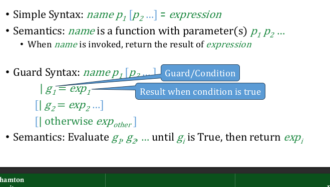

# haskell_101
Learning Haskell one step at at time

```hs
1. -- These is single line comment in haskell
```

```hs
2. -{
This is multiline comment
   -}
```

## Functional control Flow

1. Emphasis is on the "functional" view that the purpose of an expression is to return a value
2. looping is handled by recursion
3. A switch concept is handled with "guards and condiitons"


### Haskell if/then/else cnstruct

syntax: if condition then expression1 else expression2





### looping with recursion

```hs

:{
  countDown i
    | i == 0 = "Take Off!"
    | otherwise = show(i) ++ " "++ countDown(i-1)    --  ++ is string concat
  
:}
countDown 10     --calling the function
```

__Output:__

```hs
10 9 8 7 6 5 4 3 2 1 Take Off
```
